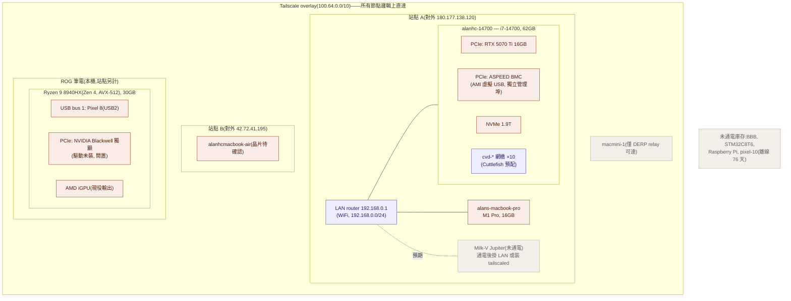
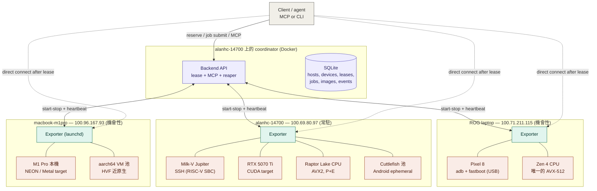
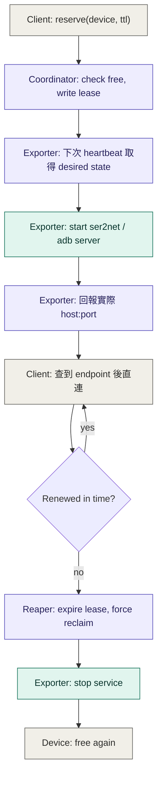

# 多使用者裝置預約系統 — 設計文件

狀態:Phase 1–3 已實作(coordinator 部署在 `alanhc-14700`)
日期:2026-09-05(設計)/ 2026-09-06(Phase 2–3 實作)

## 1. 背景與動機

過去在 AOSP(Pixel 8 kernel driver)、OpenBMC(Gerrit review)、llama.cpp(SVE
benchmark)、box64 等專案的貢獻過程中,反覆需要在 QEMU VM 跟實體裝置之間手動
切換測試環境:哪台機器接著哪個裝置、UART 有沒有人在用、要不要重刷、adb
序號是哪個——全部靠記憶跟慣例維護,沒有任何系統記錄「誰現在在用哪台裝置」。

目標是做一個輕量的多使用者、多裝置預約系統,涵蓋目前實際擁有的異質裝置:

- **Pixel 8**(shiba)——USB 接在 `100.71.211.115`
  (這台 ROG 筆電),透過 adb/fastboot 控制。
- **Milk-V Jupiter**(RISC-V)——實測於 2026-09-05:`192.168.10.101`,
  主機名 `Milk-V-Jupiter`,**SpacemiT X60**(`mvendorid 0x710`)8 核,
  Bianbu 2.1.1 / kernel 6.6.63,3 GB RAM、29.1 GB eMMC。ROG 已可免密碼
  SSH。**RVV 的 `VLEN = 256 bit`**(實測 `vlenb=32`)——正好是 Pixel 8
  SVE2 的兩倍寬,同一份 SIMD 補丁在兩邊可能得到相反結論,見第 13 節的
  matrix job。**它不在 `alanhc-14700` 的網段**(那是本文件先前的錯誤
  記載),host 歸屬見第 10 節開放問題。flash 機制仍待確認。
- OpenBMC 板子——已有 `obmc-console` 跑在上面,UART 存取本來就有現成方案。
- BeagleBone / Zephyr 板子——見 `[[bbb-iio-upstream-plan]]`。
- **MacBook Pro(M1 Pro)**——`100.96.167.93`,device 即 host(SSH)。
  NEON-only、無 SVE 的寬亂序 aarch64,補裝置矩陣的微架構多樣性
  (sse2neon 的使用者大宗就在 Apple Silicon 上);同時是 aarch64 VM 池
  的天然 host(HVF 硬體虛擬化接近原生速度,對比 x86 上的 QEMU TCG
  模擬)。`macmini-1`(`100.97.183.18`)若也是 Apple Silicon,優先當
  常駐 macOS 節點,筆電當機會性節點。
- 未來會加入的 QEMU ephemeral VM(例如 `[[qemu-lockdep-harness]]` 那類,
  boot-to-poweroff ~3 秒,不需要常駐佔用)。

所有 host 之間透過 Tailscale 構成一個扁平、直接可達的 mesh network
(`[[tigervnc-tailscale-setup]]` 已經驗證過這點),這是這份設計最重要的簡化
前提——不需要處理 NAT 穿透或 SSH jump host。

### Tailnet 盤點:每個可直連節點都是潛在的 farm 資產(2026-09-05 實掃)

| 節點 | 狀態 | farm 角色 |
|---|---|---|
| ROG 筆電(`100.71.211.115`) | 在線 | exporter host(Pixel 8 USB);機會性節點。CPU 是 **Ryzen 9 8940HX(Zen 4)= 全 farm 唯一的完整 AVX-512 x86**(f/bw/dq/vl/vnni/bf16/ifma/vbmi + sha_ni);另有 NVIDIA Blackwell laptop 獨顯但**驅動未裝**(目前跑 AMD iGPU);30GB RAM |
| `alanhc-14700`(`100.69.80.97`) | 在線 | **主力常駐 host**:i7-14700(Raptor Lake,P+E 混合核,**AVX2/AVX-VNNI,無 AVX-512**——消費級 Intel 熔斷掉了)、RTX 5070 Ti 16GB、62GB RAM、1.9T NVMe;**Cuttlefish 已裝好**(`cvd` + 10 組 instance 網橋)= 現成的 Android ephemeral 池;主機板帶 BMC(AMI 虛擬裝置 + ASPEED VGA),host 自身的 power_control 可走 BMC |
| `alans-macbook-pro`(`100.96.167.93`) | 在線 | M1 Pro:NEON/Metal target + HVF aarch64 VM 池;機會性 |
| `macmini-1`(`100.97.183.18`) | 在線 | **Intel x86_64、macOS 12.7.6**(2026-09-05 實測)——**不是** Apple Silicon,所以不能當 HVF aarch64 VM 池的 host,那個角色只剩 MacBook Pro。它是 **dual-homed**(`192.168.10.67` + `192.168.0.132`),橫跨兩個子網,是目前唯一連通兩邊的節點 |
| `alanhcmacbook-air`(`100.76.193.22`) | 在線 | 待確認晶片;機會性 |
| `pixel-10`(`100.121.46.78`) | 離線 76 天 | **tailnet-native device 的範本**(見第 5 節):手機自己在 tailnet 上,不需綁 host |
| 離線 x86 群(`nuc7i7dnhe`、`svr1`、`ms-7b53` 等) | 離線 | 可復活的 x86 容量,需要時才開機入列 |

實掃發現的缺口:BBB、STM32C8T6、Raspberry Pi 不在任何在線 host 的
USB 上(ROG 與 14700 都掃過),Jupiter 也不在 14700 的 ARP 表上——
這批板子目前沒通電,接進 farm 前要先實體接上。

### 網路發現:為什麼「誰看得到」不能決定「誰擁有」

USB 掃描有一個隱含前提:**插在我身上的裝置只有我能用**,所以 inventory
回報什麼、`devices.host` 就填什麼,這個推論成立。**網路裝置不成立**,而
且這不是假想——2026-09-05 實測:Jupiter(`192.168.10.101`)可以被 ROG、
macmini、甚至跨網段的 14700 同時摸到。若三台 exporter 都做網路發現、都
回報「我看到它」,coordinator 會判定它在各 host 之間來回搬機,每輪
heartbeat 產生一筆 `device_moved`,不斷打斷進行中的 lease。

因此:

- **發現與擁有分開。** 網路掃到的東西一律報成 candidate
  (`state='unregistered'`),**不自動填 `host`**;網路裝置的 host 是
  明確設定的,不是從可達性推論的。
- **識別碼不能用 IP。** DHCP 會換 IP,而身分綁在 `identifier` 的 UNIQUE
  約束上,用 IP 等於每次換位址就變成一台新裝置。用 MAC,或裝置自報的
  主機名/序號。
- **掃描結果會因觀察點而不一致。** 同次實測中,macmini 掃不到 ROG
  (`192.168.10.105`),但 ROG 自己在那個位址上——防火牆或無線客戶端
  隔離都會造成這種盲點。所以「某台沒掃到」**不能**當成裝置離線的證據,
  缺席判定只能用在 USB 這種可達性明確的來源上。
- **先窮盡 tailnet-native 再考慮掃描。** 能跑 tailscaled 的裝置
  (Jupiter、RPi、BBB 都是 Linux)直接入 tailnet 就沒有這些問題,
  coordinator 直連、身分是 tailnet 節點、不需要任何 exporter 代理。
  真正需要網路發現的只剩連不上 tailnet 的東西(BMC 介面、MCU)。

`inventory.py` 的 `Scanner` 是 Protocol,新增掃描來源的擴充點已經預留;
heartbeat 的 `discoverable_classes` 則已經能表達「這次回報涵蓋哪些範圍」,
網路掃描只是多一個 scope,缺席判定不會誤傷其他 class。

### 硬體拓樸(實掃 2026-09-05)

第 4 節的架構圖畫邏輯關係(誰管誰),這張畫實體連接(什麼插在什麼上、
封包實際走哪)。從 `tailscale status` 的 endpoint 看,farm 橫跨至少
兩個物理站點:14700 與 MacBook Pro 共用同一個對外 IP,MacBook Air 在
另一個;macmini 目前沒有直連路徑,只能走 DERP relay。



拓樸上有三個對設計有直接影響的事實:

1. **BMC 是獨立於 OS 的管理路**——14700 的 ASPEED 走自己的網路埠,
   host OS 掛掉也能電源回收,這是 coordinator 放這台的底氣(第 9 節)。
2. **跨站點是常態不是例外**——lease 拿到的 endpoint 走 tailscale
   overlay,物理上可能跨 WAN;對 UART/adb 這種互動流量延遲可接受,
   但 flash 傳大 image 時 exporter 端要有本地 image cache
   (`images.uri` 指 exporter 本地路徑的原因)。
3. **macmini 沒有直連路徑**——要當常駐 macOS 節點得先解決它的
   NAT/防火牆讓 tailscale 打洞成功,否則所有流量過 DERP,不適合
   當 VM 池 host。

另外兩個運維邊界是實掃踩出來的:14700 開著 Tailscale SSH check mode
(每 session 要瀏覽器授權),exporter 要無人值守連線,得先把 tailnet
ACL 的 SSH 規則改成 `accept`;14700 的 GPU 上常駐跑著 ollama/open-webui,
GPU lease 的 interstitial hook 要先停這些服務再跑 benchmark,結束後恢復,
否則 VRAM 佔用會污染數字。

## 2. 需求

**功能需求**

1. 多個使用者可以預約(獨佔)一台裝置一段時間,到期或釋放後才能被別人借用。
2. 每台裝置依類型提供以下存取方式的一部分:UART、adb、scrcpy、flash、
   video(camera streaming)、vnc、MCP。
3. 系統的最終評估標準是 **upstream 速度**:縮短「改完 code → 拿到可以
   放進 PR/Gerrit 的可信證據」的時間(見第 13 節),而不只是裝置互斥。
4. 裝置可能是常駐實體硬體(static),也可能是隨要隨生的虛擬機(ephemeral)。
5. 需要有「強制回收」機制:租約到期但使用者的 process/session 沒有正常結束時,
   系統能自己收回裝置,而不是卡死。

**非需求(刻意不做)**

- 不做 LAVA 等級的完整 CI farm(裝置字典、多階段 deploy、測試報告格式)。
- v1 的 `reserve()` 借不到就回錯誤;排隊語意由 job queue 提供(見第 12 節)
  ——這條原本寫「完全不做排隊」,但「多個 agent 在同一台 Pixel 上各自排
  實驗」的實際用法推翻了這個前提,改為在 lease 之上疊一層輕量 queue。
- v1 不做認證/授權模型的完整設計,先假設 `user_id` 是可信輸入。

## 3. 相關開源系統調研

| 系統 | 借鑑之處 | 為什麼不整套採用 |
|---|---|---|
| **Labgrid**(Pengutronix) | coordinator/exporter/client 三層架構;每個 resource 在 host 上開一個專用的小型網路服務(ser2net 包 UART、`adb server --one-device` 包 ADB),回報 `host:port` 給中央 coordinator | 整套搬過來對現在的規模太重,但架構值得照抄 |
| **LAVA**(Linaro) | device-dictionary、UART log 的想法 | job queue 導向,是為自動化 kernel CI 農場設計的 |
| **Beaker**(Red Hat) | bare-metal「借用機器」的 TTL lease 語意 | 沒有 UART/flash 的概念,是給 x86 server 用的 |
| **ser2net / obmc-console** | UART-over-network 的現成元件,OpenBMC 板子已經在用 | 本身不是完整系統,只是這份設計裡 exporter 那層要用的工具 |

決定直接借用 Labgrid 的三層架構,但拿掉它的 `proxy`/`proxy_required`
(SSH ProxyJump fallback)——那是為 exporter 主機在 NAT 後面、不能直接
連線設計的,Tailscale 已經解決了這個問題,不需要這層複雜度。

### NVIDIA 生態的對照:scheduler vs. lease

NVIDIA 那邊也有一整族「多使用者共用裝置」的系統,但集中在 GPU 側,
而且形態上跟本設計有一個本質差異,值得記下來當設計依據:

| 系統 | 解決什麼 | 跟本設計的關係 |
|---|---|---|
| **Run:ai**(2024 被 NVIDIA 收購) | k8s 上的 GPU 配額、排隊、fractional GPU;團隊間借用與搶回 | 就是本設計刻意不做的「完整 scheduler」路線 |
| **Base Command Manager**(前身 Bright)+ **Slurm GRES** | HPC job 排程:「我要 4 張 A100」,排程器決定給哪幾張 | job-queue 導向,同 LAVA 的理由不採用 |
| **MIG / vGPU / MPS** | 硬體層把一張 GPU 切成多個獨立租用的 instance | 本設計沒有對應物——Pixel 沒辦法切成兩半借給兩個人 |
| **Fleet Command** | edge 裝置(Jetson 等)的部署/管理平面 | 是 fleet 管理,不是預約系統 |

至於跟本設計最像的場景——Jetson 這類板子的 board farm——NVIDIA 沒有
公開產品;社群與 CI(如 kernelci 的 Jetson 節點)走的就是 LAVA/Labgrid
這條路,跟上表的調研結論一致。

**本質差異**:NVIDIA 整套都是 **scheduler 而不是 lease**,因為 GPU 是
可互換的(fungible)——使用者說「給我一張 A100 80GB」,哪張都行,所以
由系統挑;本設計的裝置是唯一的(那台 Pixel 8、那台 Jupiter),使用者
指名要借哪台,所以是 **lease-by-identity**。`devices.tags` 欄位是未來
往 class-based 排程演化的種子:哪天有五台相同的板子,需要
`reserve(class='riscv-sbc')` 讓系統挑一台時,才是往 Run:ai 那個方向
走的時機(見第 10 節開放問題)。

## 4. 架構



實線是 control-plane(啟停指令跟 heartbeat 共用同一條通道,雙向),虛線是拿到
lease 之後 client 直接繞過 coordinator、走 Tailscale 直連 exporter host 的
data-plane。

三個角色,對應 Labgrid 的 coordinator / exporter / client:

- **Coordinator**:單一服務,是租約與裝置狀態的唯一真相來源。不碰任何實體裝置。
- **Exporter**:跑在每台實際插著裝置的 host 上的常駐 agent。擁有裝置的
  「啟動/停止某個存取服務」的權力,並把目前可用的 `host:port` 回報給
  coordinator。
- **Client**:使用者或 agent。向 coordinator 要 lease,拿到 `device_services`
  裡的 endpoint 後直接連過去,不經過 coordinator 轉發資料流。

## 5. 資料模型

```sql
CREATE TABLE hosts (
    id         TEXT PRIMARY KEY,     -- 'rog-laptop', 'alanhc-14700', 'macbook-m1pro'
    address    TEXT NOT NULL,        -- tailscale IP
    arch       TEXT NOT NULL,        -- 'x86_64' | 'arm64'
    resources  JSON,                 -- 容量,見下方說明
    always_on  BOOLEAN NOT NULL DEFAULT TRUE,  -- 筆電節點 = false(機會性)
    last_seen_at TIMESTAMP
);

CREATE TABLE devices (
    id            TEXT PRIMARY KEY,        -- 'pixel8-shiba', 'milkv-jupiter'
    class         TEXT NOT NULL,           -- 'android' | 'openbmc' | 'riscv-sbc' | 'bbb' | 'qemu-template'
    control       TEXT NOT NULL,           -- 'adb' | 'ipmi' | 'ssh' | 'serial' | 'qemu-spawn'
    identifier    TEXT NOT NULL,           -- USB serial / IP / spawn script path
    provisioning  TEXT NOT NULL,           -- 'static' | 'ephemeral'
    host          TEXT REFERENCES hosts(id),  -- 觀測值,由 exporter inventory 回報更新;ephemeral 可為 NULL
    power_control TEXT,                    -- 強制回收用:adb-reboot / ipmi-power-cycle / sd-eject / NULL
    tags          JSON,                    -- {"arch":"arm64","sve2":true} 之類的能力描述
    state         TEXT NOT NULL DEFAULT 'free',  -- 'free' | 'leased' | 'offline' | 'maintenance' | 'unregistered'
    last_seen_at  TIMESTAMP
);

CREATE TABLE leases (
    id           INTEGER PRIMARY KEY,
    device_id    TEXT NOT NULL REFERENCES devices(id),
    user_id      TEXT NOT NULL,
    purpose      TEXT,                     -- 自由文字,方便事後追查
    created_at   TIMESTAMP NOT NULL,
    expires_at   TIMESTAMP NOT NULL,        -- TTL
    renewed_at   TIMESTAMP,                 -- 最後一次 heartbeat
    released_at  TIMESTAMP,                 -- NULL = 進行中
    status       TEXT NOT NULL DEFAULT 'active'  -- 'active' | 'released' | 'expired' | 'force_reclaimed'
);

CREATE TABLE device_services (
    device_id  TEXT NOT NULL REFERENCES devices(id),
    service    TEXT NOT NULL,     -- 'adb' | 'uart' | 'scrcpy' | 'video' | 'vnc' | 'flash' | 'mcp'
    endpoint   TEXT NOT NULL,     -- host:port(exporter 按需動態產生後回報)
    mediated   BOOLEAN NOT NULL DEFAULT FALSE,  -- true = 走 API 而非直連(flash 一定是 true)
    PRIMARY KEY (device_id, service)
);
```

**`devices.host` 是觀測值,不是設定值。** 實體裝置會搬:Pixel 8 今天
接 ROG,明天可能插到 14700。裝置的身分綁在**穩定識別碼**上
(`identifier`:adb serial、USB serial number、tty 的 by-id 路徑),
永遠不綁「插在哪台的哪個 port」。哪台 host 看得到它,是 exporter
回報出來的即時狀態(見第 8 節 inventory),coordinator 據此更新
`host` 欄位——同一顆 serial 從 A 消失、在 B 出現,就是搬機,不是
兩台裝置。這也讓新板子的接入變成零設定:BBB/STM32 隨便插進哪台
exporter host,coordinator 都會看到一筆「未登記裝置」等著 adopt。
未登記識別碼首次出現時直接建 device row(`state='unregistered'`,
`id` 暫用識別碼本身),adopt 就是補 metadata、改 id 與 state——這樣
`events.device_id` 的 FK 恆成立,unregistered 裝置也天然不可被
lease(reserve 只接受 `state='free'`)。因為身分綁識別碼,
`identifier` 要有 UNIQUE 約束;不參與 USB 發現的裝置(如 x86-cpu)
識別碼用 `<host>:cpu` 這類含 host 的形式避免互撞。

**`hosts.resources` 記容量,`devices.tags` 記身分**——兩者的差別是:
tags 是布林/列舉的能力描述(有沒有 SVE2、是什麼 SoC),用來「挑對
裝置」;resources 是會被消耗、要做 placement 決策的量
(`{"gpu":"rtx-5070ti","vram_gb":16,"ram_gb":64,"disk_free_gb":800,
"mounts":{"/data":"nvme-2t"}}`)。每台 host 的 RAM、storage、掛載槽
都不一樣,這些數字只有一個消費者:**ephemeral VM 的 placement**
(spawn 前挑一台 RAM/disk 夠的 host)跟 image/artifact 該存哪裡。
static 裝置的借用不看 resources。

**Host 上的算力本身也是 device**:14700 的 RTX 5070 Ti 是 CUDA
target,M1 Pro 的 GPU 是 Metal target——llama.cpp 這類專案的 backend
矩陣(CPU/CUDA/Metal)要各驗一輪,而 GPU benchmark 期間必須獨佔
(別人同時用會污染數字),所以 GPU 就建成一筆可租用的 device row,
走跟其他裝置完全一樣的 lease 機制,不需要特殊處理。

**x86 CPU 也是 device,因為兩台的 ISA 不可互換**:ROG 的 Zen 4 有
完整 AVX-512,14700 的 Raptor Lake 沒有(消費級 Intel 熔斷)但有
AVX-VNNI 和 P+E 混合核。做指令集實驗(sse2neon 的 SSE 基準端、
AVX-512 路徑、box64 host 側)時要指名借哪顆 CPU,所以各建一筆
device row,tags 記 `vendor`/`uarch`/`avx512`;混合核也影響
benchmark profile 的 pinning 方法(Intel 要釘 P-core,Zen 4 同質核
不用)。這是 lease-by-identity 原則在 x86 上的直接應用:

```sql
INSERT INTO devices VALUES
  ('rog-zen4',     'x86-cpu', 'local', 'cpu', 'static', 'rog-laptop', NULL,
   '{"vendor":"amd","uarch":"zen4","avx512":true,"sha_ni":true}', 'free', NULL),
  ('14700-raptor', 'x86-cpu', 'ssh',   'cpu', 'static', 'alanhc-14700', NULL,
   '{"vendor":"intel","uarch":"raptor-lake","avx512":false,"avx_vnni":true,"hybrid":true}', 'free', NULL);
```

**已實作的範例:Jupiter(2026-09-05)。** tailnet IP `100.101.114.46`,
`hosts` 不需要它的 row,`devices.host = NULL`。作法值得記著,因為它繞過了
一個以為會擋路的限制:**那台沒有免密碼 sudo,裝不了系統服務**。改用
官方的 **riscv64 靜態二進位**(`pkgs.tailscale.com`,1.102.3)解到家目錄,
以 `--tun=userspace-networking` 免 root 執行,再用 **systemd user service +
`loginctl enable-linger`**(兩者都不需要 root)做開機常駐。

實測結果:入站 SSH 走 tailnet 可用(userspace 模式會把連線代理到
localhost 的埠),直連建立後延遲 **10 ms**,跟同網段 LAN ping 的 9.5 ms
一樣——沒有中繼懲罰。注意剛連上的前幾秒會先走 DERP,要有流量之後才會
打通直連,所以**不要用剛連上的第一次測量判斷路徑品質**。

一個踩到的坑:`systemctl --user` 在 SSH 環境下需要
`XDG_RUNTIME_DIR=/run/user/$(id -u)`,沒設的話 `enable --now` 會靜默失敗
(服務顯示 disabled/inactive 且無錯誤訊息)。

**Tailnet-native device**:能自己跑 tailscaled 的裝置直接入網,
`host` 設 NULL、`identifier` 就是它的 tailnet IP——control channel
不再依賴「藏在某台 host 的 LAN 後面」,coordinator 直連,lease/queue
照常管。`pixel-10` 是現成例子(Android 有官方 client);Jupiter 裝上
tailscaled(RISC-V 編得出來)後也建議轉成這型,順便解掉它目前只能
從 14700 的 LAN 進去的限制。這型裝置沒有 exporter 代管,強制回收
只能靠裝置自身的機制(adb reboot over tailnet)或人工,建 row 時
`power_control` 要照實填。

範例 row:

```sql
INSERT INTO hosts VALUES
  ('rog-laptop',    '100.71.211.115', 'x86_64', '{"ram_gb":32}', FALSE, NULL),
  ('alanhc-14700',  '100.69.80.97',   'x86_64', '{"gpu":"rtx-5070ti","vram_gb":16,"ram_gb":64}', TRUE, NULL),
  ('macbook-m1pro', '100.96.167.93',  'arm64',  '{"gpu":"m1-pro","ram_gb":16}', FALSE, NULL);

INSERT INTO devices VALUES
  ('pixel8-shiba',   'android',    'adb', '<adb-serial>', 'static',
   'rog-laptop',    'adb-reboot', '{"arch":"arm64","sve2":true}', 'free', NULL),
  ('milkv-jupiter',  'riscv-sbc',  'ssh', '100.69.80.97', 'static',
   'alanhc-14700',  NULL, '{"arch":"riscv64","soc":"spacemit-k1"}', 'free', NULL),
  ('macbook-m1pro',  'macos-arm64','ssh', '100.96.167.93', 'static',
   'macbook-m1pro', NULL, '{"arch":"arm64","soc":"apple-m1-pro","neon":true,"sve":false}', 'free', NULL),
  ('14700-5070ti',   'gpu-cuda',   'ssh', 'cuda:0', 'static',
   'alanhc-14700',  NULL, '{"gpu":"rtx-5070ti","vram_gb":16}', 'free', NULL);
```

## 6. 各項存取能力的實作方式

| 能力 | 機制 | 是否 mediated | 備註 |
|---|---|---|---|
| **UART** | Exporter 對該裝置的序列埠跑 `ser2net`,挑一個 free port 包成 RFC2217 telnet,回報 `host:port` | 否,client 直連 | 照抄 Labgrid `SerialPortExport`;OpenBMC 板子可以直接沿用既有的 `obmc-console` |
| **adb** | Exporter 針對該 USB serial 啟動專用的 `adb server nodaemon -a -P <port> --one-device <serial>`,client `adb connect host:port` | 否,client 直連 | 照抄 Labgrid `ADBExport`;每個裝置獨立 adb server 實例,不會混到 host 上其他裝置 |
| **scrcpy** | 疊在上面的 adb 連線之上,client 端執行 scrcpy 指向該 adb 連線即可 | 否 | 不需要額外的 host 端服務,同一條 adb lease 授權涵蓋 |
| **video** | Exporter 用 ustreamer(PiKVM 那套)把對準裝置的 UVC camera 包成 MJPEG over HTTP,回報 `host:port` | 否,client 直連 | 填掉 scrcpy 的觀測空窗:fastboot 選單、boot splash 卡住、kernel panic 上螢幕時 adb 不存在,camera 是唯一的眼睛;Labgrid 的 `HTTPVideoStreamExport` 是同一概念。v1 先綁定單一 device,一鏡照多板的建模等真的發生再說 |
| **vnc** | 三種來源共用同一種 service row:ephemeral VM 用 QEMU 原生 `-vnc`(零成本);跑桌面的 SBC(Jupiter/RPi)裝置端跑 vncserver;exporter host 桌面用 TigerVNC 綁 tailnet(ROG 上已有驗證過的配方,見 [[tigervnc-tailscale-setup]]) | 否,client 直連 | 與 video 的分工:VNC 是軟體 framebuffer,OS 活著才有;video 是照實體螢幕的 camera,OS 死了照樣看。scrcpy 是 Android 專屬,VNC 是其他 Linux 目標的對應物。Cuttlefish 自帶 WebRTC 串流,不走這條 |
| **flash** | Client 呼叫 coordinator 的 flash API(`device_id` + `lease_id` + image 參照),coordinator 轉發給該 host 上 exporter 的 flash agent 執行(Android 用 fastboot,Jupiter 用 SD/eMMC 寫入) | **是** | 唯一破壞性操作,不能開放直連;每次執行要記錄 requester/image/時間,方便出事回溯(參照過去 vendor_dlkm/dtbo 重刷的教訓) |
| **MCP** | Coordinator 本身跑一個 MCP server,把 lease API + 上述能力包成 tools(`reserve_device`、`adb_shell`、`get_uart_stream`、`scrcpy_launch`、`flash_image`) | — | 每個 tool call 先檢查呼叫者是否持有該裝置的有效 lease,是 agent 操作裝置的統一前門 |

**Exporter 的 relay 原語**:真實 UART 一律用 ser2net——RFC2217 才能讓
client 遠端改 baud rate、拉 DTR/RTS,SBC 進 boot mode/救磚常靠 serial
訊號腳,raw TCP 做不到。其他一切 fd 類通道(QEMU monitor socket、gdb
stub、UNIX socket)用 **socat** 包成 TCP,尤其 ephemeral QEMU 池要把
console/monitor 暴露給 client 時。整根 USB 轉發(usbip)延遲高、斷線
脆弱,不列入預設能力;真機 USB 一律留在 exporter host 本地處理。

### Image registry 與 known-good restore

Flash service 不接受任意 image,只接受 registry 裡登記過的:

```sql
CREATE TABLE images (
    id         TEXT PRIMARY KEY,      -- 'shiba-vendor-hello-v3'
    device_id  TEXT NOT NULL REFERENCES devices(id),
    kind       TEXT NOT NULL,         -- 'boot' | 'vendor' | 'dtbo' | 'sd-card' | ...
    uri        TEXT NOT NULL,         -- exporter 本地路徑或 artifact store 位置
    sha256     TEXT NOT NULL,
    known_good BOOLEAN NOT NULL DEFAULT FALSE,
    note       TEXT
);
```

這是把目前人肉維護的還原清單(哪個分割區刷壞了要用哪個 image 救)固化
成資料。每台裝置的 `known_good` 集合就是還原目標:「restore to
known-good」成為 scheduler 的 interstitial hook 之一,agent 把裝置刷壞
時回收流程自動救回,不需人工介入。概念上借自 NVIDIA Fleet Command 的
image 管理平面。**video + image registry 是一組的**:多 agent 敢放心用
flash 的前提是「看得到」(camera 看 fastboot/開機卡哪)加「救得回」
(known-good restore);少任何一半,遠端 flash 失敗都只能盲猜。

## 7. 租約生命週期



每一個轉換(reserve / renew / release / expire / force_reclaim、exporter 的
service start/stop)在圖上沒畫出來的部分,是同時都會寫一筆 `events` row,
見第 8 節。

### Coordinator↔exporter 是 reconcile,不是 push(決定於 2026-09-05)

原本第 2 步寫成「coordinator 叫 exporter 啟動服務」,實作時發現這條通道
從未定義:`device_services` 建了表卻沒有任何讀寫。裁決是**不做 push,
改成 exporter 拉取 desired state 後自行收斂**:

- Heartbeat 的**回應**帶上「這台 host 上目前該跑哪些服務」(由 active
  lease 推導)。Exporter 比對實際在跑的,多的停、少的起——level-triggered
  的收斂,不是 edge-triggered 的指令。
- 服務起來後,**exporter 把實際的 `host:port` 寫回 `device_services`**。
  Port 是 exporter 當下挑的 free port,只有它知道;coordinator 無從預先
  決定。Labgrid 也是這個方向(exporter 的 `update_resource` 往上報)。

選 reconcile 而非 push 的理由:heartbeat 通道已經存在,不必讓 exporter
再開一個 listening port;exporter 或 coordinator 任一邊重啟後都會自動
回到正確狀態,不需要重送指令或追蹤「對方收到了沒」;斷線期間累積的
狀態差異會在恢復後一次收斂掉。

**代價是 endpoint 變成最終一致**:`reserve()` 回傳當下服務還沒起來,
endpoint 是空的,最壞要等一個 heartbeat 週期才填上。所以 lease 回應要
能表達「endpoint 尚未就緒」,client/MCP tool 取 endpoint 時要處理這個
狀態(等待或回報 pending),不能假設 reserve 一回來就能連。Heartbeat
週期因此要短(數秒級),它同時決定了借到裝置後多久能真正連上。

1. Client 呼叫 coordinator `reserve(device_id, user_id, ttl)`,裝置 `state`
   從 `free` 變 `leased`,寫入一筆 `leases` row。
2. 使用期間 client 定期呼叫 `renew(lease_id)` 更新 `renewed_at` / `expires_at`。
3. 正常結束時呼叫 `release(lease_id)`,裝置回到 `free`,exporter 停掉對應的
   per-resource daemon(ser2net/adb server)。
4. **Reaper**(coordinator 上的背景任務)定期掃描 `expires_at` 已過但
   `released_at` 仍為 NULL 的 lease:
   - 先嘗試呼叫 exporter 正常停止服務;
   - 若逾時仍未回應,依 `devices.power_control` 執行強制動作
     (adb reboot / IPMI power cycle / 斷開重插邏輯),並把 `status` 標成
     `force_reclaimed`。
   - 沒有 `power_control` 的裝置類型(目前 Jupiter 尚未確認)在設計完成前
     暫時無法被強制回收,只能標記 `offline` 並通知人工介入。

## 8. 遙測與可觀測性

目前設計沒有任何「事後查得到發生什麼事」的機制——裝置卡死時只能用猜的,
host 掛掉也要等有人去借才會發現。加兩個輕量機制,而不是上一整套
observability stack:

```sql
CREATE TABLE events (
    id          INTEGER PRIMARY KEY,
    device_id   TEXT NOT NULL REFERENCES devices(id),
    lease_id    INTEGER REFERENCES leases(id),  -- 跟裝置無關的事件(如純 heartbeat)可為 NULL
    kind        TEXT NOT NULL,   -- 'reserve' | 'renew' | 'release' | 'expire' | 'force_reclaim'
                                 -- | 'service_start' | 'service_stop' | 'flash_start' | 'flash_result'
                                 -- | 'device_moved' | 'device_attached' | 'device_detached'
    actor       TEXT,            -- user_id,或 'reaper' / 'exporter' 代表系統自己觸發
    detail      JSON,            -- 自由格式,如 flash 的 image 參照、force_reclaim 的原因
    created_at  TIMESTAMP NOT NULL
);
```

1. **`events` 是 append-only 稽核紀錄**:每個 lease 狀態轉換、每次 exporter
   啟停 per-resource daemon、每次 flash job 的成敗都寫一筆。事後要查「這台
   裝置為什麼卡住」或「誰在什麼時候重刷過」,直接查這張表就好,不用去翻
   散落各處的 log 檔。
2. **Exporter 的 heartbeat 同時是 inventory 回報**(沿用第 4 節的
   control-plane channel,不另外開連線):除了「我還活著」,每次都帶上
   「我現在看得到哪些裝置」——adb serial 清單、USB serial number、
   `/dev/serial/by-id/` 內容。Coordinator 拿穩定識別碼比對 registry:
   - 已知裝置出現在新 host → 更新 `devices.host`,寫 `device_moved`
     event;若它有進行中的 lease,該 lease 的 service endpoint 已失效,
     視同斷線處理(通知持有者、endpoint 要在新 host 重建);
   - 已知裝置從原 host 消失且沒在別處出現 → 標 `offline`,寫
     `device_detached` event;拔線發生在 lease 進行中時同上;
   - 沒見過的識別碼 → 記一筆 `unregistered` 裝置等 adopt,新板子
     隨插隨報,不用改設定檔。
   Exporter 端用 udev monitor 做即時觸發、定時 poll 做兜底(Labgrid
   的做法)。Reaper 除了掃 `leases.expires_at`,也掃 `last_seen_at`
   過舊的 host/裝置,自動標 `offline`——不用等使用者踩到才知道。

**主要 tradeoff**:這兩個機制幾乎零成本(都只是多寫幾筆到同一個 DB),已經
涵蓋大部分實際會想查的東西(誰在用什麼、什麼失敗了、host 還活著嗎)。真的
需要儀表板或告警時,可以直接在 `events`/`devices` 表上疊一個 `/metrics`
endpoint 給 Prometheus 刮,不用重做——但兩台 host、幾個裝置的規模,現在
就上整套 Prometheus + Grafana 是不必要的維運負擔。

## 9. 部署方式

Coordinator 跟 exporter 對「cloud native」的適合程度完全相反,不能一概而論:

- **Coordinator 適合容器化**:它不碰硬體,只讀寫 DB,包成 Docker image
  (SQLite/Postgres 掛 volume)之後能隨便重部署、版控、加健康檢查,沒有理由
  不做。
- **Exporter 不適合做「cloud native 排程」**:它一定要釘在那台實體插著
  裝置的 host 上跑,這正好違背 k8s「workload 可以排到任何 node」的核心
  假設。硬塞進 k8s 只能靠 nodeAffinity + hostPath device passthrough 把它
  強制釘死在唯一的 node 上,本質上就是「Docker 加一堆 YAML」,沒有真正拿到
  排程彈性的好處。

**Coordinator 放在 `alanhc-14700`**(決定於 2026-09-05):它是唯一的
常駐 Linux 節點(`always_on = TRUE`),已經在跑 Docker(ollama/
open-webui),主機板帶 BMC——連 coordinator host 自己卡死都能從 BMC
電源回收,是整個 farm 裡最不該掛也最救得回的位置。同一台上它同時是
主力 exporter(Jupiter、5070 Ti、Cuttlefish 池),coordinator 與
exporter 是兩個獨立 process,只是共居。ROG 筆電降級為純機會性節點。

**決定**:coordinator 用 Docker 容器化,exporter 在兩台 host 上各自用
plain Docker(`--device` 掛 USB、`--network host` 讓 ser2net/adb server
綁的 port 直接暴露)+ systemd 常駐,不上 k3s/k8s。這樣拿到大部分「好部署、
好升級」的好處,不用背整個 cluster 的維運成本。如果之後裝置池真的擴大到
需要跨很多台 host 排程(例如大量 ephemeral QEMU 節點),再重新評估
k3s + tailscale operator 這條路。

**macOS 節點的三個例外**:

- exporter 不能用 Docker 部署——macOS 的 Docker 本身就是一層 Linux
  VM,直接用 launchd 跑原生 process。
- 筆電會睡:蓋上蓋子、電池模式就離線。heartbeat 機制天然處理
  (`hosts.always_on = FALSE` 的節點,offline 是常態不是異常),但
  matrix job 需要對應語意——見第 13 節的 wait-or-skip。
- benchmark 方法學整套不同:macOS **沒有** thread-to-core affinity
  API(沒有 taskset 等價物),只能用 QoS class 引導 P/E core;沒有
  可調 governor;`powermetrics` 讀頻率/功耗需要 sudo。這正是第 13 節
  benchmark profile 要按平台分開維護的原因。

## 10. 開放問題

- ~~Jupiter 的 exporter host 未定~~ **已解決(2026-09-05)**:Jupiter 自己
  加入了 tailnet,成為 tailnet-native 裝置,不需要任何 exporter 代理,
  「誰擁有它」的問題直接消失。作法見下方。
- **Milk-V Jupiter 的 flash 機制未確認**(flash mediation 本身已實作,
  但 Jupiter 這條路徑只擺了 `dd` 的形狀,沒有驗證):是 SD 卡插拔重燒,還是需要短接
  boot pin / 按 button 進入 USB burn mode?這決定 `power_control` 該填什麼,
  也決定 flash agent 要不要處理「進入 flash mode」這個額外步驟。
- **認證模型未設計**:目前 `user_id` 假設可信,尚未決定是每個使用者一組
  API token,還是直接綁定 Tailscale identity(`tailscale status` 已經有
  每個 node 的帳號資訊,理論上可以直接拿來當身份來源,不用另外做一套)。
- ~~**Ephemeral QEMU 裝置是否該常駐一筆 `devices` row**~~
  **已解決(2026-09-06,實作時)**:沿用同一張 `devices` 表。template 是
  一筆 `class='qemu-template'` 的 row,借它就 spawn 出一筆
  `class='qemu-vm'`、`provisioning='ephemeral'` 的實例 row。理由是 lease、
  events、`device_services` 全部以 `device_id` 為軸,實例不進表的話這三套
  機制都要各自長出「如果是 VM 的話……」的分支。
  實作時多冒出一個沒預期到的約束:用完的實例**不能刪 row**,因為
  `events.device_id` 是硬性 FK 而 §8 明講 events 是 append-only。改成標
  `retired`(借不到、不列出來),稽核鏈才完整。
- **從 lease-by-identity 演化到 class-based 排程的時機**:目前每台裝置
  都是唯一的,指名借用即可。當同一種裝置有多台——具體來說,現在只有
  一台 Pixel,未來預期會再接其他台——使用者開始說「隨便給我一台
  android 裝置」時,才需要在 lease API 上加一層「按 `class`/`tags`
  挑選」的邏輯——也就是往第 3 節對照的
  Run:ai/Slurm 那種 scheduler 形態靠近一步。在那之前不做。注意這跟
  第 12 節的 job queue 是兩件正交的事:queue 解「一台裝置多人排隊」
  (需求端),class-based 挑選解「多台同種裝置挑一台」(供給端);
  兩者都成立時,`jobs.device_id` 改為可空、配上 class 條件即可銜接。
- **小板子目前全部離線**(2026-09-05 實掃 ROG 與 14700 後確認):
  Raspberry Pi、BeagleBone Black、STM32C8T6、Jupiter 都不在任何在線
  host 的 USB/ARP 上,應該沒通電。接哪台 host 不用預先決定——
  第 8 節的 inventory 機制讓它們隨便插進哪台 exporter host 都會
  自動出現等 adopt。STM32 這類無 OS 的板子屆時是新的 device class
  (`control='swd'`,flash 走 OpenOCD/st-flash,「console」是
  ST-Link 的 VCP)。
- **Mac 要不要跑 bare-metal Linux(Asahi)**:box64 等需要真 Linux 的
  工作,VM 能涵蓋大部分 userspace 情境;bare metal 得在日用筆電上
  雙開機,代價是否值得,等實際需求出現再決定。`macmini-1` 的硬體
  規格(是否 Apple Silicon)也待確認。

## 11. 分階段實作計畫

**Phase 1 的 adb 路徑已在真機驗證通過(2026-09-06)**:ROG + 真 Pixel 8,
reserve → 收斂 → endpoint 發布 → `adb -H … -P …` 真的列出裝置並執行
`getprop`(回 `AOSP on shiba`)→ release → 服務停、endpoint 消失。全程
全域 adb server 沒有被起來,inventory 也沒有誤判拔線。

過程中真機抓到兩個單元測試看不見的 bug,都已修正,值得記著它們的形狀:
(1) preflight 起了 `adb kill-server` 卻沒等它跑完就 terminate——**假設被
寫成註解卻從未驗證**,而 fake runner 的 terminate 不會打斷真實工作,所以
測試永遠是綠的;修法除了 `wait()`,還讓測試替身「只有被 wait 到才算完成
工作」,替身不再比真東西寬容。(2) inventory 用 `adb devices` 掃描會**啟動
全域 server 並認領 USB 裝置**,跟自己的 per-device server 互搶;改讀
`/sys/bus/usb/devices` 的 ADB interface descriptor(`ff/42/01`,已對真
Pixel 核對),並加一條「掃描期間執行任何子行程就失敗」的回歸測試。

uart 接真序列埠、多裝置 preflight 仍未驗證(沒有實體序列埠、只有一顆
Android 裝置)。

**Phase 2–3 的執行層大多沒碰過真硬體,只有 Cuttlefish 例外(2026-09-06)。**
所有新能力都走可注入的 `ProcessRunner`,單元測試與整合測試用 fake 跑完整
迴圈(含對真 coordinator 的 HTTP 語意)。

**已在真硬體驗過的:Cuttlefish 池。** 用程式碼產生的 argv 真的開了一台
`aosp_cf_x86_64_only_phone` 起來,`adb connect 127.0.0.1:6520` 後
`getprop` 回得出 `Cuttlefish x86_64 phone` / Android 16,`cvd stop` 也
正常。**而且真機抓到一個測試看不見的 bug**:`cvd stop` 之後 group 仍留在
`cvd fleet` 裡(只是 status 變 `Stopped`),只看 group 在不在的話停掉的
實例會被永遠當成活著。這跟 Phase 1 的 adb 一樣——真機才抓得到的形狀。

**仍未驗證的:** `fastboot` 從未對真 Pixel 執行過(ROG 那顆有手工構築的
分割區狀態,測之前要先取得同意)、`dd` 沒寫過真的 SD 卡、ustreamer 沒接過
camera、socat 沒轉發過真的 VNC server、也沒有真的開起來過一台 QEMU VM。
收斂邏輯有測試,「工具跑不跑得起來」沒有——見兩個子專案 README 的驗證
狀態表。

- **Phase 1**:Coordinator 部署在 `alanhc-14700`(schema + lease API,
  含 `events` 表跟 heartbeat)+ 一個 exporter(ROG 筆電,只管 Pixel 8)
  + MCP 前門,支援 uart 跟 adb。Telemetry 從一開始就做,因為成本幾乎
  是零。前置作業:tailnet ACL 的 SSH 規則 `check`→`accept`,否則
  coordinator↔exporter 的無人值守連線會卡在瀏覽器授權。
- **Phase 2**(2026-09-06 完成):強制回收、coordinator 容器化、
  image registry 與 flash mediation、第二個 exporter 都已完成。
  14700 本機的 exporter 跑成 systemd user service(`exporter/deploy/`),
  管 Jupiter、5070 Ti 與本機 CPU。**Cuttlefish 池也接上了**:它是
  ephemeral 的第二種 provisioner(第 12 節),跟 QEMU 池共用同一套
  template→實例機制,差別只在 exporter 那端起的是 `cvd` 而不是
  `qemu-system-*`,以及實例對外提供的是 adb 而不是 vnc(§6 明講
  Cuttlefish 自帶 WebRTC 串流,不走 vnc)。**整條路已在真硬體上跑通**
  (2026-09-08):borrow template → exporter service 開出一台 AVD →
  adb endpoint 發布到 tailnet → 遠端執行指令拿到
  `Cuttlefish x86_64 phone` / Android 16。關鍵是 `--enable_sandbox=false`
  ——crosvm 的 per-device minijail 在 systemd user service 裡建不起來,
  那是「手動跑得起來、服務跑不起來」的真正原因(不是先前以為的
  `unshare(CLONE_NEWNS)`,那行在成功的執行裡也會出現)。

  接這台 exporter 時發現一個設計沒涵蓋的缺口:它管的三台裝置**沒有一台
  在 USB 上**,而 Phase 1 的兩個 scanner 只掃 USB,所以它們的
  `last_seen_at` 永遠是 `NULL`,第 8 節的 reaper 偵測不到它們離線。補了
  兩個 scanner,而它們的差別正是上面「網路發現」那節的規則:本機 CPU/GPU
  可以參與缺席判定(「插在我身上的只有我用得到」成立),**tailnet-native
  的 Jupiter 不行**——它走一條只更新 `last_seen_at`、不宣稱擁有的回報
  路徑(`seen`),否則三台看得到它的 host 會互相搶著宣稱擁有權。
- **Phase 3**(2026-09-06 完成,除了 OpenBMC):scrcpy(不需要 host 端
  服務,做成回傳指令的 tool)、video(ustreamer)、vnc(socat 轉發既有
  server)、ephemeral QEMU 池都已實作。**OpenBMC 板子整合還沒做**——
  它要沿用既有的 `obmc-console`,是接線問題不是新機制。
- **Phase 4**:job queue(第 12 節)——`jobs` 表 + scheduler loop +
  裝置類別的 interstitial hooks + 硬體分層(`needs` 宣告與 VM 池
  placement)。疊在 lease 之上,前面的每一階段都不依賴它。
- **Phase 5**:upstream job 層(第 13 節)——benchmark profile、
  A/B paired job、matrix job、evidence bundle,最後才是 CI 觸發。
  image registry 不在此階段——它隨 Phase 2 的 flash mediation 一起做,
  因為 mediated flash 本來就需要「只接受登記過的 image」。

## 12. 往 scheduler 演化:agent 多工

實際用法裡,常常是多個 agent 在同一台 Pixel 上各自跑不同實驗——瓶頸
不是「五台一樣的板子挑哪台」(供給端 fungibility,Run:ai/Slurm 解的
問題),而是「一台唯一的裝置,很多個排隊的使用者」(需求端多工)。
這不需要把 lease 換成 scheduler,而是在 lease 上疊一層 queue:

**lease 仍是唯一的互斥原語,scheduler 只是決定下一個 lease 給誰。**
coordinator/exporter 分工、reaper、events 全部不變。

```sql
CREATE TABLE jobs (
    id          INTEGER PRIMARY KEY,
    device_id   TEXT REFERENCES devices(id),   -- 指名裝置;class-based 排程成形後可為 NULL + class 條件
    user_id     TEXT NOT NULL,                 -- agent 的身分也走這欄
    kind        TEXT NOT NULL,                 -- 'batch' | 'interactive'
    payload     JSON,                          -- batch:要跑的 script/artifacts 參照;interactive:NULL
    timeout_s   INTEGER NOT NULL,              -- 硬上限,超時視同結束、lease 交給 reaper 回收
    state       TEXT NOT NULL DEFAULT 'queued',-- 'queued' | 'running' | 'done' | 'failed' | 'cancelled'
    lease_id    INTEGER REFERENCES leases(id), -- 進入 running 時由 scheduler 代為建立
    result      JSON,                          -- exit code、log/artifact 參照
    created_at  TIMESTAMP NOT NULL,
    started_at  TIMESTAMP,
    finished_at TIMESTAMP
);
```

**兩種 job 形態**,對應 agent 的兩種工作模式:

- **batch**:agent 提交一個自足的工作(跑這個 benchmark、insmod 這個
  module 然後跑 hello_test),exporter 代為執行,agent 只要輪詢 `result`。
  agent 不持有連線、不佔 session,是多 agent 情境的主要形態。
- **interactive**:排隊等一個 lease。輪到時 job 進 `running`,scheduler
  建立 lease 並通知呼叫者,之後的行為跟第 7 節完全一樣(直連、renew、
  release)。這其實就是「reserve() 的排隊版」,給需要來回互動的
  agent/人用。

**`reserve` 不可以阻塞。** 有了佇列之後最容易寫錯的地方:讓
`reserve_device` 卡著等到輪到自己。MCP 的 tool call 卡幾分鐘會拖死呼叫端
的 agent。正確形狀是立刻回一張號碼牌(佇列位置,可能的話附預估等待),
呼叫者之後用 `get_lease_status` 輪詢。

**MCP 必須網路化,佇列才有意義。** 原本的 MCP server 是 stdio-only——
client 得在同一台機器上把它 spawn 起來、還要讀得到本機 DB 檔,所以「各機器
上的 agent 連進來共用裝置」在傳輸層就不成立。改成 HTTP/SSE 由 coordinator
容器一起服務。這個改動會**放大授權問題**:`user_id` 目前是呼叫者自填、系統
完全信任(見第 10 節),stdio 時代還說得過去(能 spawn process 的人本來就
在機器上),開成網路服務之後任何連得到的人都能宣稱是任何人,包括釋放別人
的 lease。身分取得的位置要收斂到一處,之後接 tailnet identity 只換那一處。

**Scheduler loop**(併入 coordinator,跟 reaper 同層):裝置變 `free`
時,從該裝置的 queue 取下一個 job → 建 lease → batch 就派給 exporter
執行,interactive 就通知呼叫者。排序用 FIFO 加一條規則:**人的
interactive 請求排在 agent batch 前面**——agent 等得起,人等不起。
更細的優先權等真的出現飢餓問題再加。

**Interstitial hooks(兩個 job 之間的裝置清理)是 scheduler 真正的
難點**,比排序本身重要:

- 連續的 agent 實驗會互相污染裝置狀態:上一個 job 留下的 module、
  tmpfiles、還沒 reboot 的 kernel 狀態,都會讓下一個實驗的結果不可信。
  每種 `class` 要定義 job 之間的重置動作(android:`adb reboot` 或
  解除安裝;qemu ephemeral:直接銷毀重生,天然乾淨;刷壞的裝置:
  restore to known-good,見第 6 節 image registry)。
- **Benchmark job 需要 thermal cooldown**:shiba 的 thermal HAL 按
  skin temp 節流(見 [[pixel8-benchmark-methodology]]),前一個 agent
  的重負載 job 會讓下一個 benchmark 在半節流狀態起跑,量出假數字。
  帶 `benchmark` tag 的 job 開始前,exporter 要等 skin temp 降回門檻
  以下——這種 device-class-specific 的知識放在 interstitial hook 裡,
  而不是要求每個 agent 自己記得。

**硬體分層政策:真機時間是稀缺資源,只花在非真機不可的事上。**
job 宣告 `needs: 'real-hw' | 'any'`:`any` 的工作(lockdep、fuzzer、
功能測試)一律導去 ephemeral VM 池平行跑,真機 queue 只留 thermal/
perf/驅動硬體相關的工作。VM 池的 placement 看 `hosts.resources`
(RAM/disk 夠不夠)跟架構:**aarch64 job 優先導去 M1 的 HVF VM 池**
(硬體虛擬化、接近原生速度),x86 host 上的 QEMU TCG 模擬只當備援
——同樣的 GKI 驗證在兩者上差一個量級。Android userspace 的 `any`
工作另有一條現成的路:14700 上 **Cuttlefish 已經裝好**(`cvd` +
預配 10 組 instance 網橋),AVD 就是 Android 的 ephemeral 池,
真機 Pixel 只留 kernel/thermal/perf 工作。這是把 queue 從「排隊機制」
升級成「資源分配政策」,對應 Run:ai 的稀缺資源利用率邏輯。

## 13. 為 upstream 速度設計的 job 層

整個系統的最終目的不是裝置管理,是縮短「改完 code → 拿到可以放進
PR/Gerrit 的可信證據」的時間。這層把過去踩坑換來的方法學固化成
可執行的機制,`jobs` 表加三個欄位:`profile TEXT`、`pair_id INTEGER`、
`matrix_id INTEGER`。

**Benchmark profile:方法學即程式。** 量測陷阱是平台特定的,而且每個
都曾經產生過「看起來合理的錯誤數字」:

- Android(shiba):thermal HAL 按 skin temp 節流、MIF 頻率不能 pin、
  兩台 Pixel 的 cluster 編號相反、toybox taskset 的怪癖
  (見 [[pixel8-benchmark-methodology]]);
- Linux:governor pinning、single-pointer benchmark 會在 X3 上讓
  結果翻正負號(見 [[bionic-sve-string-routines]]);
- macOS:**沒有** thread affinity API,只能用 QoS class 引導 P/E core;
  無可調 governor;`powermetrics` 要 sudo。

每個平台一份 profile,exporter 執行帶 profile 的 job 時自動做
pinning、thermal gate(等溫度降回門檻)、N 次重複,並在 `result`
裡附上環境指紋(kernel 版本、頻率、起始溫度)。對應 MLPerf
submission rules 的精神:環境紀錄跟數字本身一樣重要。

**A/B paired job。** upstream perf 工作永遠是「baseline vs patch」。
`pair_id` 把兩個 job 綁成一對,scheduler 保證同一台裝置上 ABAB
交錯執行,自動抵消 thermal/頻率漂移,產出可直接引用的對照表。
llama.cpp SVE regression 的 per-file bisect(幾十組成對比較)就是
這個形態的人肉版。

**Matrix job:一個 patch 展開到整個裝置矩陣。** sse2neon、llama.cpp
這類補丁天生要在多種微架構上各驗一輪:Pixel 8(SVE2-128)、
Pixel 10、Jupiter(RVV)、M1 Pro(NEON-only 寬亂序 + Metal)、
ROG(Zen 4,全 farm 唯一的 AVX-512)、14700(Raptor Lake,
AVX2/AVX-VNNI + CUDA)——x86 這兩台的 ISA 不對稱本身就是矩陣的
一個維度。`matrix_id` 把一組 job 綁成一個矩陣,
提交時給 device/class 清單,scheduler 各自排隊、收攏成一張結果表。
機會性節點(`hosts.always_on = FALSE`,如兩台筆電)離線時,提交者
選擇 **wait**(等它上線)或 **skip**(跳過並在矩陣標註缺口)。

**Evidence bundle。** matrix/paired job 的結果可匯出成一份自足的
markdown(數字 + 環境指紋 + 重現步驟),直接貼進 PR 或 Gerrit
comment。對應過去的教訓:perf 主張要寫成 reviewer 可檢驗的敘述,
而不是「在我機器上快了 X%」。

**CI 觸發(最後一步)**:push 到 fork 的 branch 自動跑對應的
matrix。價值高,但依賴 profile/paired/matrix 都先存在,放在
它們全部就位之後。
